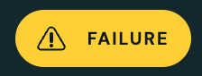
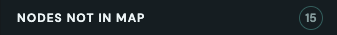
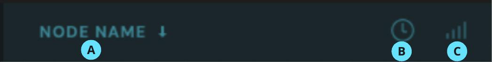
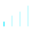

# Manage Nodes

NodeAdmin show all nodes in a table and where they are placed on the map. This is also where it is possible to set up a node as Muster station and Muster station with muster box

## Toolbar

<table>                                                                                                                                                                                                                                                                                                                                                                                                                                                                                                       |´
    <thead>
        <tr>
            <th>List item</th>
            <th>Explanation</th>
            <th>Variations</th>
        </tr>
    </thead>
    <tbody>
        <tr>
            <td>A</td>
            <td>Search for nodes by mac address. The number of nodes visible in the map (GA - General Arrangement) and the <a href="#node-list">node list</a> will decrease as a user types in the search bar.</td>
            <td>NIL</td>
        </tr>
        <tr>
            <td>B</td>
            <td>Filter toggle for placed nodes in the map.</td>
            <td>
                <ul>
                    <li class="list-no-bullet-points"> Default on - Shows nodes that are placed in the map</li>
                    <li class="list-no-bullet-points"> Placed nodes are now hidden in the map.</li>
                </ul>
            </td>
        </tr>
        <tr>
            <td>C</td>
            <td>Filter toggle for not placed nodes in the map.</td>
            <td>
                <ul>
                    <li class="list-no-bullet-points"> Default on - Shows nodes that are NOT placed in the map</li>
                    <li class="list-no-bullet-points"> NOT placed nodes are now hidden in the map.</li>
                </ul>
            </td>
        </tr>
        <tr>
            <td>D</td>
            <td>Filter toggle for nodes configured as musterstations in the map. More on musterstation configuration <a href="#node-manager">here</a>.</td>
            <td>
                <ul>
                    <li class="list-no-bullet-points"> Default on - Shows nodes that are configured as musterstations in the map with the musterstation icon </li>
                    <li class="list-no-bullet-points"> Nodes configured as musterstations are now hidden in the map.</li>
                </ul>
            </td>
        </tr>
        <tr>
            <td>E</td>
            <td>Filter toggle for node links in the map. More on node links <a href="#showing-node-parent">here</a>.</td>
            <td>
                <ul>
                    <li class="list-no-bullet-points"> Default on - Shows the lines between nodes depending on what is selected, it shows Parent, children, or neighbors</li>
                    <li class="list-no-bullet-points"> Node links are now hidden in the map.</li>
                </ul>
            </td>
        </tr>
        <tr>
            <td>F</td>
            <td>System status. This is dependent on active system alarms and how critical these are:</td>
            <td>
                <ul>
                    <li class="list-no-bullet-points"></li>
                    <li class="list-no-bullet-points list-with-extra-padding"> System status: OK</li>
                    <li class="list-no-bullet-points"></li>
                    <li class="list-no-bullet-points list-with-extra-padding"> System status: Failure</li>
                    <li class="list-no-bullet-points"></li>
                    <li class="list-no-bullet-points"> System status: Critical Failure</li>
                </ul>
            </td>
        </tr>
        <tr>
            <td>G</td>
            <td>Mute button to mute audible alarms from the digital output node. More on the digital output node <a href="#node-manager">here</a>.</td>
            <td>
                <ul>
                    <li class="list-no-bullet-points"> Possible to press button to send mute command</li>
                    <li class="list-no-bullet-points"> Mute button is disabled when the system is sending mute command</li>
                </ul>
            </td>
        </tr>
        <tr>
            <td>H</td>
            <td>Mustering toggle to initiate or deactivate Mustering in the ScanReach system. More on Mustering <a href="mustering.md">here</a>.</td>
            <td>
                <ul>
                    <li class="list-no-bullet-points"></li>
                    <li class="list-no-bullet-points list-with-extra-padding"> Mustering is off</li>
                    <li class="list-no-bullet-points"></li>
                    <li class="list-no-bullet-points"> Mustering is initiated</li>
                </ul>
            </td>
        </tr>
        <tr>
            <td>I</td>
            <td>Embarked personnel in the ScanReach system.</td>
            <td></td>
        </tr>
    </tbody>
</table>

## Map (GA - General Arrangement)

This map show the vessel and all its rooms. It is possible to place nodes from the [node list](#node-list) in the map. The placement in the map should represent the physical placement onboard the vessel.
It is possible to select how to view the node links in the map.

| List item                                                                               | Explanation                                                                              |
| :-------------------------------------------------------------------------------------- | :--------------------------------------------------------------------------------------- |
|                                      | Selected node.                                                                           |
|                                        | Indicates a node placement.                                                              |
|                                                   | Indicates the Root node placement.                                                       |
|                                 | Indicates the Root node placement, node has errors.                                      |
|                               | Indicates a node placement, configured as a musterstation.                               |
|              | Indicates a node placement, configured as a musterstation, node has errors.              |
|                                    | Indicates a node placement, configured as a gangway.                                     |
|                   | Indicates a node placement, configured as a gangway, node has errors.                    |
|                             | Indicates a node placement, configured as a modbus or NMEA node.                         |
|             | Indicates a node placement, configured as a modbus or NMEA node, node has errors.        |
|  | Indicates that a node is moveable in the map. Activated by [node manager](#node-manager) |

### Showing node parent

Shows a line from the selected node to its parent. It will also show the path if there is grand parents, great grand parents etc. until it gets to the root node which is communicating with the gateway. It is a good tool to see what nodes are depending on others to be able to perform their task.

### Showing node children

Shows a line to the children of the node. A node can have several children.

### Showing node neighbours

Shows a line to the 10 neighbours with best signal of a node and the signal strength to each node. These nodes are the possible parents or children of the selected node.

## Node list

Shows all nodes placed in map, and not placed in map.

### Components in the node list

 

#### OWC Status

Press the icon to request a new update of the nodes. If a configuration is not as you expect, this can be a good first step to see if the configuration will update

#### Table headers

Headings for the different sections showing the number of nodes in each section.

#### Node list table header

Sub header where it is possible to sort items by name, time or signal strength in Ascending or Descending order.

| List item | Explanation                                                                                                         | Variations                                      |
| :-------: | :------------------------------------------------------------------------------------------------------------------ | :---------------------------------------------- |
|     A     | Sort node on name                                                                                                   | NIL                                             |
|     B     | Sort by the time since the system last received a signal from the node                                              |                |
|     C     | Sort by the nodes by signal strength    Meaning how strong the signal is between the node and its parent node |  |

#### Node list table item

This is a node that has been added to the system. This node can be configured and placed in the map to display its position on the vessel.

 <table>                                                                                                                                                                                                                                                                                                                                                                                                                                                                                                                        |                                                                                                                                                                                                                                                                                                                                                                                                                                                                                                                        |
    <thead>
        <tr>
            <th>List item</th>
            <th>Explanation</th>
            <th>Variations</th>
        </tr>
    </thead>
    <tbody>
        <tr>
            <td>A</td>
            <td>Node name</td>
            <td>NIL</td>
        </tr>
        <tr>
            <td>B</td>
            <td>Status icon that shows the status of the node</td>
            <td>
                <ul>
                    <li class="list-no-bullet-points"> Blue - All is ok</li>
                    <li class="list-no-bullet-points"> Orange - There is an issue attached to the node</li>
                    <li class="list-no-bullet-points"> Grey - Node is not placed in map</li>
                </ul>
            </td>
        </tr>
        <tr>
            <td>C</td>
            <td>Mac address of the node</td>
            <td>NIL</td>
        </tr>
        <tr>
            <td>D</td>
            <td>A icon to indicate what roles the node has been set to. There will only be one icon show even though the node has more than one role. Click on node to see all the roles a node has.</td>
            <td>
                The possible icons are:
                <ul>
                    <li class="list-no-bullet-points">None</li>
                    <li class="list-no-bullet-points"> This node is set up as the Root node. This means that this node is the parent node and is connected to the gateway. This is the basis for setting up all other nodes. They will report to this through their own network.</li>
                    <li class="list-no-bullet-points"> This node is set up as a Modbus sensor</li>
                    <li class="list-no-bullet-points"> This node is set up as a Muster station</li>
                    <li class="list-no-bullet-points"> This node is set up as a Gangway node.</li>
                    <li class="list-no-bullet-points"> This node is set up as an Alarm node</li>
                    <li class="list-no-bullet-points">There are two colours a role icon can have:</li>
                    <li>Blue - All is ok</li>
                    <li>Orange - Configuration is being applied</li>
                </ul>
            </td>
        </tr>
        <tr>
            <td>E</td>  
            <td>This is the time since the system last had a report from this node.</td>
            <td>- , Now or number of minutes, hours, days, months or years</td>
        </tr>
        <tr>
            <td>F</td>
            <td>This icon indicates how good the signal strength is to the parent node in the mesh network</td>
            <td>
                <ul>
                    <li class="list-no-bullet-points"> Poor</li>
                    <li class="list-no-bullet-points"> OK</li>
                    <li class="list-no-bullet-points"> Good</li>
                    <li class="list-no-bullet-points"> Very good</li>
                </ul>
            </td>
        </tr>
    </tbody>
</table>

#### Node list table item details

When clicking a node item this extended information that is attached to the node will show.

<table>
 <thead>
        <tr>
            <th>List item</th>
            <th>Explanation</th>
            <th>Variations</th>
        </tr>
    </thead>
    <tbody>
        <tr>
            <td>A</td>
            <td>Node roles shows what the Node is configured as.</td>
            <td>
                <ul>
                    <li class="list-no-bullet-points list-with-extra-padding">The possible values here are:</li>
                    <li class="list-no-bullet-points">"This node has no roles"</li>
                    <li class="list-no-bullet-points list-with-extra-padding">The node is not assinged any roles</li>
                    <li class="list-no-bullet-points list-img-center"></li>
                    <li class="list-no-bullet-points list-with-extra-padding">This node is connected to a digital output node and will give and audible and visual alarm if a distress alarm is activated.</li>
                    <li class="list-no-bullet-points list-img-center"></li>
                    <li class="list-no-bullet-points list-with-extra-padding">This node is set up as a muster station. This can be used to either automatically muster personnel that this node detects in a muster scenario or it can help when seeing where personnel is at the map. It is important to always set up a minimum of one node as a muster node to be able to handle a muster scenario in the best way.</li>
                    <li class="list-no-bullet-points list-img-center"></li>
                    <li class="list-no-bullet-points list-img-center"></li>
                    <li class="list-no-bullet-points list-with-extra-padding">This node is also a muster station but it is also connected to or connecting to a muster box. This box will enable the personnel to "tap in" during a muster scenario to physically confirm that they have met at the muster station and is accounted for.</li>
                    <li class="list-no-bullet-points list-img-center"></li>
                    <li class="list-no-bullet-points list-img-center"></li>
                    <li class="list-no-bullet-points list-with-extra-padding">This node is connect to a Modbus instrument.</li>
                    <li class="list-no-bullet-points list-img-center"></li>
                    <li class="list-no-bullet-points list-img-center"></li>
                    <li class="list-no-bullet-points list-with-extra-padding">This node is connect to a NMEA instrument and is crucial to get gps data.</li>
                    <li class="list-no-bullet-points list-img-center"></li>
                    <li class="list-no-bullet-points list-img-center"></li>
                    <li class="list-no-bullet-points list-with-extra-padding">This node is connected to a gangway box or connecting to a gangway box. This makes it possible to drop off and embark personnel during gangway operations by having them "tap" their wearable to the box. This makes keeping the count of number of personnel aboard the vessel correct at all times.</li>
                    <li class="list-no-bullet-points list-img-center"></li>
                    <li class="list-no-bullet-points list-with-extra-padding">This is the root node of the system. Which means it is the base node and parent node to all other nodes. This node needs to be in place for the system to function properly. Do not remove this node without first contacting ScanReach support.</li>
                    <li class="list-no-bullet-points list-with-extra-padding">The orange "pills" with "Applying" text indicates that the configuration is in the process of being applied. If this status persist, make sure that the correct equipment is connected to the node. Else contact scanreach support and we will help you with the problem.</li>
                </ul>   
            </td>
        </tr>
        <tr>
            <td>B</td>
            <td>What is the name of the node that is the Parent node of this node. Parent node is the node that this node reports to.</td>
            <td>Root - or what the parent node is named</td>
        </tr>
        <tr>
            <td>C</td>
            <td>This is the time since the system last had a report from this node.</td>
            <td>- , Now or a number of minutes, hours, days, months or years</td>
        </tr>
        <tr>
            <td>D</td>
            <td>Signal strength to parent node shown in decibel.</td>
            <td>NIL</td>
        </tr>
        <tr>
            <td>E</td>
            <td>Number of parents - How many nodes does this node report to</td>
            <td>NIL</td>
        </tr>
        <tr>
            <td>F</td>
            <td>Number of children - How many nodes reports to this node</td>
            <td>NIL</td>
        </tr>
        <tr>
            <td>G</td>
            <td>Number of Neighbours - How many nodes does this node pick up signal from.</td>
            <td>NIL</td>
        </tr>
        <tr>
            <td>H</td>
            <td>Click to remove the node from the map - A pop up will appear to make sure the act of removing the node is a conscious decision. If the node is not currently placed in the map, this button will say "Place" and by clicking this you can place the node in the node by dragging it to the location it is physically placed on the vessel.</td>
            <td>"Remove" or "Place"</td>
        </tr>
        <tr>
            <td>I</td>
            <td>Click to manage the node - Change the node configuration or change location of an already placed node in the map</td>
            <td>NIL</td>
        </tr>
        <tr>
            <td>J</td>
            <td>Click to open a debug tool that shows all the related information from the node. Mostly used by ScanReach if support is needed or during testing</td>
            <td>NIL</td>
        </tr>
        <tr>
            <td>K</td>
            <td>Click to close the node list table item details</td>
            <td>NIL</td>
        </tr>
    </tbody>
</table>

## Node manager

Opened by pressing the "Manage" button in the [Node List Table Item Details ( I )](#node-list-table-item-details). This is where a user can place a node in the map, change location of a placed node, set a node as muster station with or without a muster box, set retention and/or sensitivity level for muster station and muster box and lastly set a node as a Alarm node.

### Interacting with node manager

<table>
<thead>
        <tr>
            <th>List item</th>
            <th>Explanation</th>
        </tr>
    </thead>
    <tbody>
        <tr>
            <td>A</td>
            <td>Node Icon</td>
        </tr>
        <tr>
            <td>B</td>
            <td>Heading</td>
        </tr>
        <tr>
            <td>C</td>
            <td>Mac address of selected node</td>
        </tr>
        <tr>
            <td>D</td>
            <td>Node name, a user can edit the node name. Max length of name is 30 characters</td>
        </tr>
        <tr>
            <td>E</td>
            <td>Toggle Node to be a muster station. This will enable the node to register personnel as accounted for or show that a person is located at a musterstation during mustering. To learn more about mustering <a href="mustering.md">click here</a>.</td>
        </tr>
        <tr>
            <td>F</td>
            <td>
                <ul>
                    <li class="list-no-bullet-points">This section is shown when Muster station is toggled on. By setting the Mustering retention you select how much advantage (in decibels) muster station nodes have over regular nodes when detecting a person.</li>
                    <li class="list-no-bullet-points">The higher the dB, the closer the person have to be another node to switch location to that node. This means that a user can be detected by another node and in be closer to that node, but will not be loose their Accounted For status during mustering unless the signal strength to the other node is higher than the retention level that is set.</li>
                    <li class="list-no-bullet-points">This allows personnel to move around more freely during a mustering.</li>
                </ul>
            </td>
        </tr>
        <tr>
            <td>G</td>
            <td>
                <ul>
                    <li class="list-no-bullet-points">It is possible to select 1 of 3 pre-made retention levels.</li>
                    <li class="list-no-bullet-points">
                        <ul>
                            <li>High - Ideal for open spaces like hallways or cranes, where personnel may be occasionally detected by nearby nodes. Provides a 15dB RSSI boost.</li>
                            <li>Normal - Suitable for most vessels, where personnel at muster stations are not frequently detected by nearby nodes. Offers a 10dB RSSI boost.</li>
                            <li>Low - Designed for vessels with robust node coverage in muster areas, typically with nodes installed in the roof. Provides a 5dB RSSI boost.</li>
                        </ul>
                    </li>
                </ul>
            </td>
        </tr>
        <tr>
            <td>H</td>
            <td>Clicking the <strong>SET CUSTOM</strong> button will enable a input field where a user can define their own custom retention level, this will overwrite any selected pre-made value. This value has to be between 1 and 99. Clicking the <strong>CANCEL CUSTOM</strong> will deactivate this field and ignore the value used there.</td>
        </tr>
        <tr>
            <td>I</td>
            <td>
                <ul>
                    <li class="list-no-bullet-points">It is possible to set a node as a Muster box. With the muster box it will be possible to manually register personnel by them "tapping" their wearable to the muster box. The registration will be indicated by a light, and will show the person as manually registered in the "Accounted for" section of the Safety page. This will only happen when Mustering is initiated and will set a person as "Accounted for" regardless if they are automatically mustered or not. To use a node as a Muster box, make sure you have connected the box</li>
                </ul>
            </td>
        </tr>
        <tr>
            <td>J</td>
            <td>
                <ul>
                    <li class="list-no-bullet-points">This section is shown when "Node is connected to a Muster-box" is toggled on. By setting the Box Sensitivity you select the sensitivity in decibels (dB) of the muster box, this is done to determine how close a person needs to be the muster box to self-register.</li>
                    <li class="list-no-bullet-points">The thickness of clothes covering the wearable can diminish the signal strength from the wearable.</li>
                </ul>
            </td>
        </tr>
        <tr>
            <td>K</td>
            <td>
                <ul>
                    <li class="list-no-bullet-points">It is possible to select 1 of 3 pre-made sensitivity levels.</li>
                    <li class="list-no-bullet-points">
                        <ul>
                            <li>High - Best for heavily obstructive clothing or challenging conditions, but may result in unwanted detections. Equivalent to a RSSI of -40dB.</li>
                            <li>Normal - Well-balanced sensitivity for most situations. Recommended default setting. Equivalent to a RSSI of -36dB.</li>
                            <li>Low - Reduces chances of unwanted detections but may make detecting wearables more difficult. Equivalent to a RSSI of -32dB.</li>
                        </ul>
                    </li>
                </ul>
            </td>
        </tr>
        <tr>
            <td>L</td>
            <td>Clicking the <strong>SET CUSTOM</strong> button will enable a input field where a user can define their own custom sensitivity level, this will overwrite any selected pre-made value. This value has to be between -1 and -99. Clicking the <strong>CANCEL CUSTOM</strong> will deactivate this field and ignore the value used there.</td>
        </tr>
        <tr>
            <td>M</td>
            <td>
                <ul>
                    <li class="list-no-bullet-points">It is possible to toggle a node to set it up as a Alarm node. By connecting the node to an alarm unit and toggling this, the Alarm Unit will give an audible alarm and light when a distress alarm is detected by the system. To use a node as a Alarm Node, make sure you have connected the Alarm Unit and have placed it in an area that is constantly manned.</li>
                </ul>
            </td>
        </tr>
        <tr>
            <td>N</td>
            <td>There is limitation to what tasks a node can perform in unison. Therefore the <strong>Alarm node</strong> toggle is disabled in this example
                <ul>
                    <li>Incompatible combinations are:</li>
                    <li>Gangway &amp; <strong>Alarm node</strong></li>
                    <li>Modbus &amp; <strong>Alarm node</strong></li>
                    <li>NMEA &amp; <strong>Alarm node</strong></li>
                    <li>Muster-box &amp; <strong>Alarm node</strong></li>
                </ul>
            </td>
        </tr>
        <tr>
            <td>O</td>
            <td>There is limitation to what tasks a node can perform in unison. Therefore the <strong>Muster Box</strong> toggle is disabled in this example
                <ul>
                    <li>Incompatible combinations are:</li>
                    <li>Gangway &amp; <strong>Muster-box</strong></li>
                    <li>Modbus &amp; <strong>Muster-box</strong></li>
                    <li>NMEA &amp; <strong>Muster-box</strong></li>
                    <li>Alarm node &amp; <strong>Muster-box</strong></li>
                </ul>
            </td>
        </tr>
    </tbody>
</table>

## Mesh Debug Tool (MDT)

Opened by pressing the "Debug" button in the [Node List Table Item Details ( J )](#node-list-table-item-details). This is a tool for admin users or ScanReach to use during debugging or internal testing. We will break down the image into sections and explain each point in the list.

### Breakdown of sections in the Mesh Debug Tool

 

#### MDT - Heading section

<table>
    <thead>
        <tr>
            <th>List item</th>
            <th>Explanation</th>
        </tr>
    </thead>
    <tbody>
        <tr>
            <td>A</td>
            <td>The given name of the node.</td>
        </tr>
        <tr>
            <td>B</td>
            <td>Signal strength to parent node in decibel. This value will alway be minus. 
                <ul>
                    <li><strong>Green value</strong> -0 to -69 the node has GOOD connection to parent node.</li>
                    <li><strong>Yellow value</strong> -70 to -79 the node has OK connection to parent node, consider adding another node between the two nodes.</li>
                    <li><strong>Red value</strong> -80 or worse, the node has BAD connection to parent node and another node should be placed between the two to ensure that all data will be transmitted.</li>
                </ul>
            </td>
        </tr>
        <tr>
            <td>C</td>
            <td>Nodes mac address</td>
        </tr>
        <tr>
            <td>D</td>
            <td>Time since node last reported to parent node. Updates every 5 minutes. If time since is more than 20 minutes the time will have a orange colour.</td>
        </tr>
    </tbody>
</table>

#### MDT - Node data 1

This is the BLE (Bluetooth Low Energy) MCU (Micro Controller Unit) in the node that handles bluetooth communication between equipment it detects (Wearables and bluetooth sensors). Time since updates every 3 minutes.

| List item                       | Explanation                                                                                                           |
| :------------------------------ | :-------------------------------------------------------------------------------------------------------------------- |
| USB-Connected                   | Is the node connected to a instrument with a usb cable. True = yes, False = No.                                       |
| Battery Charging                | Is the battery charging. True = yes, False = no.                                                                      |
| Temperature                     | The temperature the node is registering at its placed location.                                                       |
| Voltage                         | The internal voltage of the node.                                                                                     |
| Uptime                          | How long the MCU have been on since last reset in seconds.                                                            |
| Parent Rssi                     | Signal strength to parent node in decibel. This value will alway be minus. Rssi (Received Signal Strength Indicator). |
| Node Version                    | What version is the firmware in the node running. This should be the same as Node data 2.                             |
| BLE Version                     | What BLE version is the node running. This should be the same as Node data 2.                                         |
| NordicOutOfSec                  | Number of lost inter-SOC messages.                                                                                    |
| Buffers full-count              | Number of times mem_alloc() was called and no buffers was available.                                                  |
| Queue Full-count                | Number of times the queue was full when trying to add a message.                                                      |
| Lowest No. Of Buffers Available | Number of lowest buffers available ever reached.                                                                      |
| NordicCRCErrCount               | Number of times a CRC error have occurred on the serial interface.                                                    |

#### MDT - Node data 2

This is the Mesh MCU (Micro Controller Unit). This is the chip in the node that handles the communication between nodes. Time since updates every 3 minutes.

| List item         | Explanation                                                                                          |
| :---------------- | :--------------------------------------------------------------------------------------------------- |
| Udpseqno          | UDP (User Datagram Protocol) sequence number.                                                        |
| Uptime            | The time since last reset in seconds.                                                                |
| NodeVersion       | What version is the firmware in the node running. This should be the same as Node data 1.            |
| BLEVersion        | What BLE (Bluetooth Low Energy) version is the node running. This should be the same as Node data 1. |
| Reset attempts    | How many times the chip has tried to reset itself when it could not connect to borderrouter.         |
| Summary count     | How many times the OTA Summary message has been received.                                            |
| SecSinceSummary   | Seconds since last received OTA Summary message.                                                     |
| BS build-version  | Mesh MCU Bootstrapper version.                                                                       |
| OTA build version | Mesh MCU OTA version.                                                                                |
| RPL build-version | Mesh MCU Application version.                                                                        |

#### MDT - Neighbours Data

Number of nodes this nodes sees around itself. Time since updates every 15 minutes.

| List item      | Explanation                                                                                                                                                            |
| :------------- | :--------------------------------------------------------------------------------------------------------------------------------------------------------------------- |
| Neighbours     | How many other nodes this node registers near itself. These are nodes that this node receives signal from and could therefore be part of the data flow to the gateway. |
| SequenceNumber | The current sequence number for the communication with neighbouring nodes.                                                                                             |

#### MDT - Parent Data

What node this node uses as preferred parent node. Time since updates every 30 minutes.

| List item  | Explanation                     |
| :--------- | :------------------------------ |
| Parent Mac | Mac address of the parent node. |

#### MDT - Reset Data

Reason for why node was reset.

| List item  | Explanation               |
| :--------- | :------------------------ |
| Reset Data | Reason for node resetting |
