# Mustering - Keep your crew safe

The mustering functionality is created to help the vessel with their own Mustering training or real world scenarios. The mustering functionality will give the user a quick overview of the location of all personnel and if they have arrived at the registered Muster Stations

## Desktop Components

### Node Admin page

Node Admin show all nodes in a table and where they are placed on the map. This is also where it is possible to set up a node as Muster station and Muster station with muster box

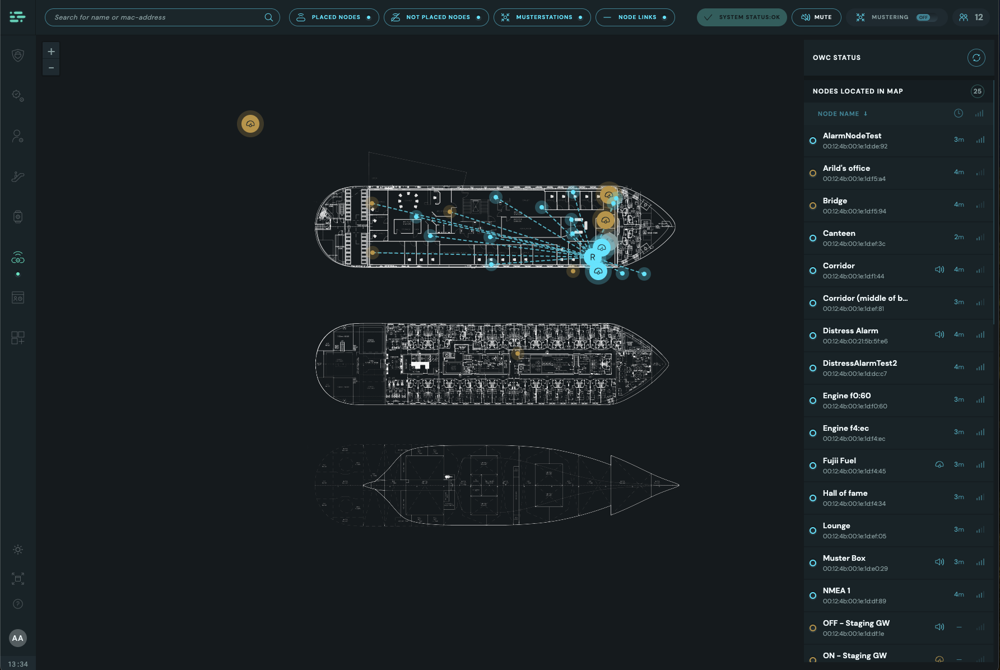

#### Node Admin Table

Shows all nodes distrubted between, Nodes located in the map and Nodes not in map.

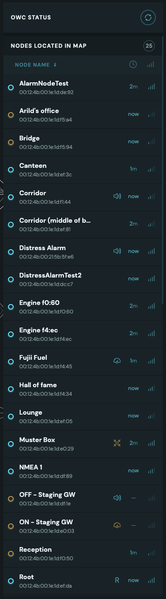
 

Press the icon to request a new update of the nodes. If a configuration is not as you expect, this can be a good first step to see if the configuration will update

 

Headings for the different sections showing the number of nodes in each section
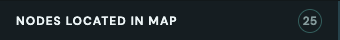
 

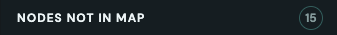
 

Node admin table header
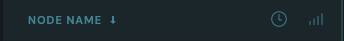

- It is possible to sort Node name both decending and acending
- This icon indicates time
- This icon idicates signal strength
   
   

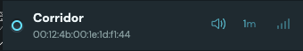

- Staus Icon that show the status of the node
  - Blue - All is ok
  -  Orange - There is an issue attached to the node
  -  Grey - Node is not placed in map
- "Corridor" - The given name of the node
- "00:12:4b:00:1e:1d:f1:44" - Mac address of the node
- 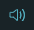A icon to idicate what roles the node has been set to. There will only be one icon show even though the node has more than one role. Click on node to see all the roles a node has. The possible icons are:

  - None
  - This node is set up as the Root node. This means that this node is the parent node and is connected to the gateway. This is the basis for setting up all other nodes. They will report to this through their own network
  -  This node is set up as a Modbus sensor
  - 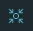 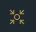This node is set up as a Muster station
  -  This node is set up as a Alarm node
  - There is two colours a task icon can have:
    - Blue - All is ok
    - Orange configuration is being applied

- "1m" - This is the time since the system last had a report from this node
- 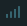 This icon indicates how good the signal strength is to the parent node in the mesh network
   
   

#### Node Admin Table Item Details

Shows the extended information that is attached to the node
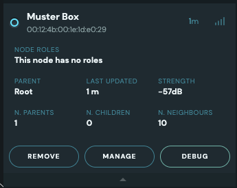

- Node roles shows what the Node is configured as. The possible values here are
  - "This node has no roles"
  - 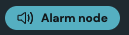
  - 
  - 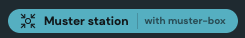 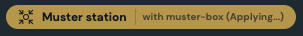
  -  
  - 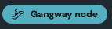
  - 
  - The orange ones with "Applying" text indicates that the configuration is in the process of being applied. If this status persist, make sure that the correct equipment is connected to the node. Else contact scanreach support and we will help you with the problem.
- Node roles shows what the Node is configured as. The possible values here are

#### Node Details

### Initiate Muster Toggle

#### Start Mustering Pop up

#### Stop Mustering Pop up

### Safety Page

### Searchbar

### Mustering Stats

#### Auto Muster Toggle

##### Auto Muster Toggle Pop up

#### Timer

#### Mustering bar

### Sections

#### Not Accounted For

#### Accounted For

#### Distress Alarms

### Section Items

#### Accpinted for / Not Accounted for Personnel Item

#### Distress alarm Item

#### Searchbar Item

#### Personnel Item

##### During Mustering

###### Manually reigster personnel not Embarked Pop up

##### Normally

#### Node Item

### Node Details List

## Tablet Components

## How too:

### Setting up a Muster Station

### Initiate Muster

### Switch Auto Muster to ON/OFF

### Search for Personnel, Wearables or Nodes

### Manually Register Personnel

### Manually Register Personnel by Search

### Handling Distress Alarms

## FAQ
