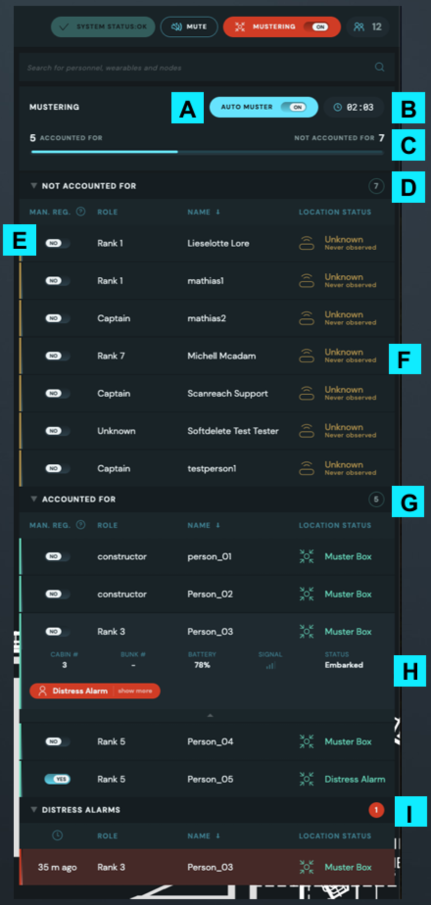

# Mustering - Keep your crew safe

The mustering functionality is created to help the vessel with their own Mustering training or real world scenarios. The mustering functionality will give the user a quick overview of the location of all personnel and if they have arrived at the registered Muster Stations

## Configure nodes as muster stations

1. Go to "Manage Nodes" in the left menu
2. Select the node you want to configure as a muster station -> Click "manage"
3. Toggle "Muster Station" to YES
4. Define "Mustering Retention level (dB)" for this node

::: tip
The retention level is how "sticky" the node will be after a person has been seen by that node. The higher the retention level, the closer you must be nearby nodes to be picked up by them.

This is useful if you have a muster station that is close to another node inside the vessel, to avoid personnel "leaking" to nearby nodes.
:::

5. If you want to configure the node as a Muster Station with Muster Box, toggle "Tap on muster-box to muster" to YES and define required signal strength for a wearable to be detected by the muster box.

## Start mustering

To start mustering toggle the "mustering" toggle top right. In the modal you can:

- Add a comment
- Define the mustering as a drill

This comment and whether the mustering is a drill or not will be visible in ConnectFleet.

## During mustering

During mustering you will be presented with a list of:

- All personnel that are not accounted for
- All personnel that are accounted for
- All distress alarms

- A: What mustering mode you are in:
  - Auto Muster ON - The system will automatically set personnel as accounted for when they arrive at a muster station
  - Auto Muster OFF - Requires personnel to either manually register on a MusterBox or being manually toggled to accounted for by an operator
- B: The time since the mustering started
- C: Progress bar showing number of people accounted for vs number of people not accounted for
- D and G: Detailed list showing name and role of Not Accounted (or Accounted for) For personnel and their location
- E: Toggle for manually registering a person as accounted for, regardless of their location. Useful if person forgot wearable or is on a rescue mission.
- F: Location status:
  - Orange + Node Icon: This person's wearable has an issue and the Location is uncertain, will show time since last observed at that Location
  - Grey + Node Icon: Person is detected at a node that is not a Muster Station
  - Green + Mustering Icon: Person is detected at a Muster station and will be automatically Accounted For when "Auto Muster" is "ON". It also gives a good indication on who can be Manually Registered when "Auto Muster" is OFF.
- H: Selecting a person will show that person's details.
- I: List of personnel in distress

### Manually register during mustering

To manually register a person as accounted for, click the toggle next to the person's name. This will change the toggle to active and the person will be moved to the "Accounted For" list.

### Manually register disembarked personnel during mustering

Use the search bar to search for the person's name. Press the "Manually register" toggle on the desired person and the person will be moved to the "Accounted For" list.

- The person will still stay disembarked/dropped off until the person is assigned a wearable and marked as embarked in ConnectPOB or in external crew management system.
