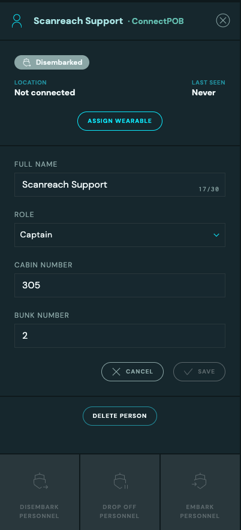

# Personnel Administration

In order for a person to be located by ConnectPOB, the person must:

1. Exist in ConnectPOB
2. Assigned to a wearable
3. Embarked

::: tip
Most vessels equipped with ConnectPOB are connected with **Unisea** or **OCS**. This means the process described here is **not** necessary for most vessels.
:::

## Searching / registering new personnel

1. Open Personnel Administration page by clicking the icon of a person in the left navbar: 
2. Start writing the name of the person in the search field in top bar. -> The list of personnel should be filtered as you type.
3. If the person is not found, you can register a new person by clicking the "Register a new person".
4. Now you can fill in the details of the person and click "Register".
   
   - The newly addded person is now saved and available in the list of personnel.

## Assigning wearables / embarking personnel

1. Open Personnel Administration page by clicking the icon of a person in the left navbar
2. Search for the person you want to assign a wearable to
3. Click the table row of the person
   
4. Click the "Assign wearable" button
5. Find the mac address of the wearable on the back of the physical wearable
   <!-- TODO: Replace images of wearable with more high res image -->
   
    
    
   
6. Enter in the search box the last 4 digits of the mac address (ex: `DF:13`)
   ::: danger
   On first use the wearable needs to be powered on before it can be used. See `Wearable activation and usage` for more information.

   A yellow warning symbol will show if wearable is not powered on or out of battery.
   :::

7. Optionally you can check the toggle "Embark this person this wearable is assigned" to assign and embark in one operation.
8. Click `Confirm` and person should now be assigned to the wearable.
9. Repeat for rest of crew.
